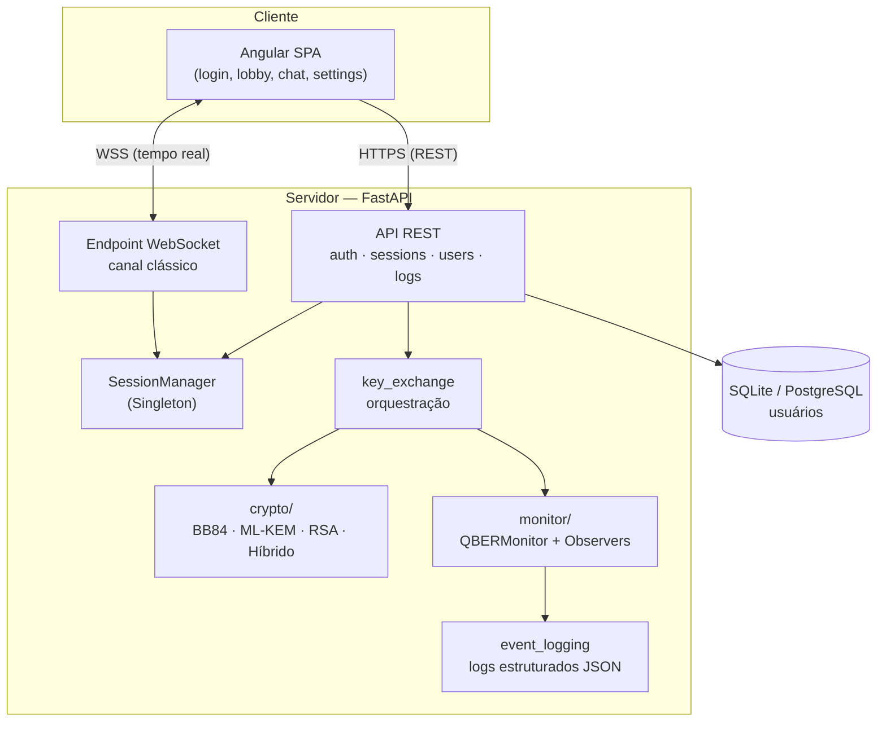

# Arquitetura — QChat

Visão técnica do sistema de chat híbrido QKD+PQC.

## Visão geral de componentes

## Camadas

| Camada | Responsabilidade |
|---|---|
| **Frontend** (`frontend/`) | SPA Angular; cifra/decifra mensagens com Web Crypto |
| **API REST** (`app/api/`) | Autenticação, gestão de sessões, exportação de logs |
| **WebSocket** (`app/api/websocket.py`) | Canal clássico — notificações e relay de mensagens |
| **Núcleo** (`app/core/`) | Config, segurança (JWT/bcrypt), `SessionManager`, orquestração de chave |
| **Cripto** (`app/crypto/`) | Os 4 protocolos + cifragem AES-256-GCM + adversário simulado |
| **Monitor** (`app/monitor/`) | Monitoramento de QBER via padrão Observer |
| **Persistência** | Apenas usuários — **mensagens nunca são persistidas** |

## Decisões técnicas

### Estabelecimento de chave no servidor

O servidor executa os protocolos de estabelecimento de chave (`crypto/`) e
distribui a chave de sessão aos dois participantes pelo canal WSS. Isso mantém os
módulos criptográficos — objeto de estudo do TCC — como implementação de
referência. O frontend cifra/decifra as mensagens com essa chave (Web Crypto).
Documentado em `app/core/key_exchange.py`.

### Mensagens efêmeras

Mensagens existem apenas durante a sessão ativa e nunca tocam o banco. Garante
*forward secrecy* da camada de transporte: comprometer o servidor no futuro não
revela conversas passadas.

### Cifragem ponta a ponta

As mensagens trafegam como envelopes AES-256-GCM cifrados no cliente; o servidor
apenas faz o relay. O `MessageCipher` (Python) é a referência; o
`MessageCryptoService` (TypeScript) o espelha — mesmo *associated data*
`session_id|sequence_number|timestamp`.

## Padrões de projeto

| Padrão | Onde | Função |
|---|---|---|
| **Strategy** | `KeyEstablishmentProtocol` | Interface comum aos 4 modos |
| **Factory** | `ProtocolFactory` | Cria o protocolo conforme o modo |
| **Singleton** | `SessionManager` | Estado único de sessões e conexões |
| **Observer** | `QBERMonitor` + observers | Reação a medições de QBER |

## Modelo de adversário

`EveSimulator` suporta três modos (`PASSIVE`, `INTERCEPT_RESEND`,
`BEAM_SPLITTING`), ativados apenas por configuração e **nunca em produção**
(`configured_eve()` força `PASSIVE` quando `ENVIRONMENT=production`).

## Stack

- **Backend:** Python 3.11, FastAPI, Qiskit Aer, liboqs-python, PyCryptodome, cryptography, SQLAlchemy
- **Frontend:** Angular 21 (standalone + signals), Angular Material
- **Infra:** Docker, nginx, GitHub Actions
